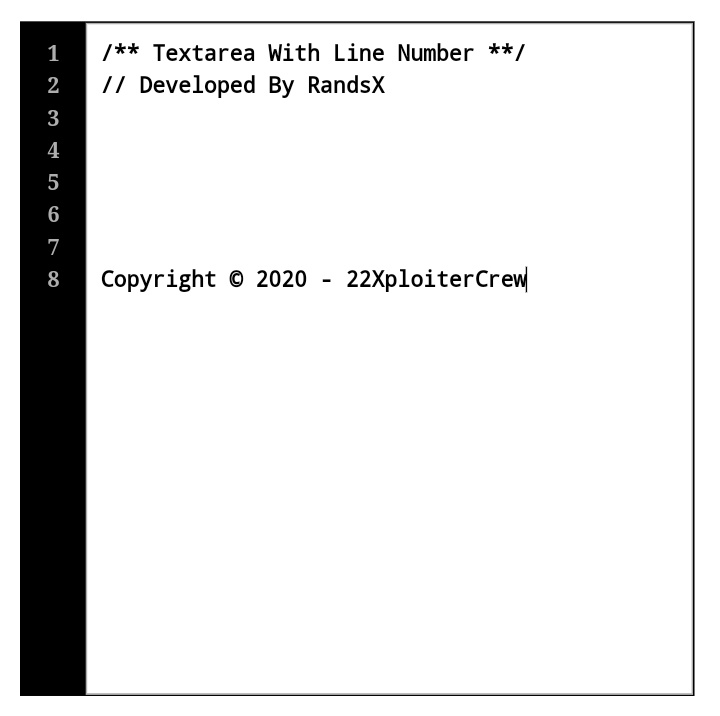

# Textarea Line Number
Modified textarea field with line number.


## How to use ?
### Import With RawCDN
CSS File
```
https://rawcdn.githack.com/RandsX/Textarea-Line/a7b8ad93e95caed275ef4a244522d363d4a0ebd4/css/TextareaLine.min.css
```

Javascript File
```
https://rawcdn.githack.com/RandsX/Textarea-Line/a7b8ad93e95caed275ef4a244522d363d4a0ebd4/js/TextareaLine.min.js
```

Example code
``` HTML
<!DOCTYPE html>
<html lang="en">
<head>
  <meta charset="UTF-8">
  <meta name="viewport" content="width=device-width, initial-scale=1.0">
  <meta http-equiv="X-UA-Compatible" content="ie=edge">
  <title>Document</title>
  <!-- Import CSS File -->
  <link rel="stylesheet" href="https://rawcdn.githack.com/RandsX/Textarea-Line/a7b8ad93e95caed275ef4a244522d363d4a0ebd4/css/TextareaLine.min.css" type="text/css" media="all" />
  <style type="text/css" media="all">
    /* THIS IS VERY IMPORTANT, FOR ID NAME OR CLASS YOU CAN LIKE YOU! */
    .example {
      background-color: black;
      color: white;
      border: 1px solid black;
      position: relative;
      height: 500px;
      width: 500px;
      margin: 15px auto
    }
  </style>
  <!-- Import JavaScript File -->
  <script src="https://rawcdn.githack.com/RandsX/Textarea-Line/a7b8ad93e95caed275ef4a244522d363d4a0ebd4/js/TextareaLine.min.js" type="text/javascript" charset="utf-8"></script>
</head>
<!-- If the Document is currently loading, initialize a TextareaLine -->
<body onload="TextareaLine.appendLineNumber('YourTextareaIDName');">
  <div class="example">
    <textarea id="YourTextareaIDName"></textarea>
  </div>
</body>
</html>
```
The document with class name ```example``` is a parent to hold your textarea.

## Support By
- 22XploiterCrew
- Infinity Cyber Team